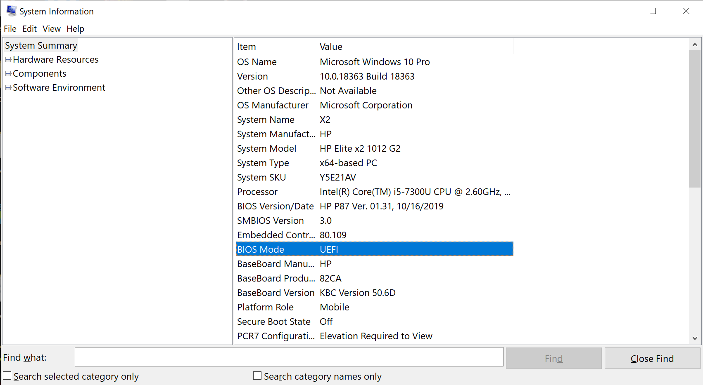

# UEFI Systems

Ever since UEFI, the disk default partition map format is GPT (GUID Partition Table), which added support for more than 2TB of disk size and more than 4 partitions that was the limit of MBR while still keeping a backward compatibility with MBR for legacy systems. If your computer (prebuilt) came with Windows 8 (2012 and later), then your disk is probably partitioned as GPT.

Usually, 2012+ computers that came with Windows 8 would have a UEFI firmware (some OEMs released Windows 7 releases alongside those, so make sure yours has UEFI), and this is a newly spread firmware type (that was in development since the 2000s) and was already deployed on Apple computers ever since the intel switch (but their own heavily modified firmware, it's called EFI and not UEFI for the lack of universality). This new firmware has some new features like Secure Boot, help with faster booting, hardware passthrough, graphical interface with mouse support (and more). To know more about UEFI and Secure Boot check this writeup by Osy86 [here](https://osy.gitbook.io/hac-mini-guide/details/secure-boot). Basically, a UEFI boot goes something like this:

- UEFI Firmware loads up
- Loads its integrated drivers and services
- Reads the boot menu entries and start loading the first boot entry
  - If failed starts the next one
- Loads the bootloader
  - OS is loaded after that.

Usually, the said "bootloader" is contained somewhere in the disk, and that somewhere is called a **EFI Partition**. You can find this named different things like ESP (EFI System Partition), SYSTEM, EFI, BOOT and so on. This partition is **FAT32** formatted and flagged as **EF00** in MBR or **C12A7328-F81F-11D2-BA4B-00A0C93EC93B** GUID in GPT. This partition contains usually the EFI applications (like an OS bootloader) in it that are loaded at boot by the UEFI firmware (remember this as it is important for later for recovery).

# Legacy/CSM Systems

Contrary to UEFI, Legacy systems are older and much more mature (dating back to the first IBM PCs). They're certainly a lot more limited and slower than UEFI on the same system but hold better compatibility with a lot of OSes (even macOS in some rare cases). Computer pre-2012 usually have this type of firmware (some exceptions like servers and some professional laptops and so on that can also have UEFI, they're not reliable thought in that mode). The computer would usually come with a version of Windows that is older than Windows 8 with a hard drive that is less than 2TB. Some desktop users at this time would also install OSes in Legacy mode even if their motherboard supports the newer UEFI standard. This could create issues with multibooting later on.

These systems rely on another method of loading the bootloader. This piece of software is usually written in the first sectors of the disk (formatted as MBR) called **boot sector**, this sector is usually 512 or 4096 bytes big, the BIOS would then read the code, copy it to memory and then execute it, at that point an OS or Bootloader menu (like GRUB2) will show up:

- BIOS Starts up
- Reads the **boot sector**
- Loads the program into memory
- Executes the program
- Bootloader appears
  - The OS will boot now.

# Major differences between the systems

We'll put them in a table to show the main differences:

|                                                            | **UEFI**                                                     | **Legacy**                                                   |
| ---------------------------------------------------------- | ------------------------------------------------------------ | ------------------------------------------------------------ |
| Fast Boot                                                  | ✅ (on most)                                                  | ❌ (only some do, not a standard)                             |
| Bootloader Chooser through the boot menu                   | ✅ (on most)                                                  | ❌ (only some do, not a standard)                             |
| Secure Boot                                                | ✅ (on most)                                                  | ❌ (only some do, not a standard)                             |
| Add a bootloader without overwriting the others            | ✅ (on most)                                                  | ❌ (only some do, not a standard)                             |
| Supporting 2TB+ boot disks                                 | ✅ (hardware dependent)                                       | ❌ (requires GPT, which is supported on some Legacy systems, 2006+) |
| Legacy Hardware Support                                    | ⚠️ (depends on which hardware, CSM switch should be possible) | ✅ (hardware dependent)                                       |
| Easier maintenance (managing bootloaders and boot entries) | ✅ (on most)                                                  | ❌ (only some do, not a standard)                             |
| OS Support                                                 | ✅                                                            | ✅                                                            |

Aside from Legacy hardware support (which is rare anyways nowadays), UEFI is the firmware to use when dual booting on newer hardware (2012+). But for legacy users, there is also a way to get some UEFI features but only through DUET (will be later discussed).

# Detecting which firmware you're using

## No OS

If your computer:

- is from Ivy Bridge era (~2012) and later
- has a Windows 8 Sticker

Then it probably has **UEFI system**, that said, it doesn't mean older generation motherboards do not, however with Windows 8 release, Microsoft standardized the UEFI specs for OEMs to get their certification (usually if you go with brand names like ASUS, Lenovo, HP, Dell... you're good to go).

Any older than the above and the chances of having a proper UEFI implementation diminishes and you're better off with a Legacy booting.

## On Windows

Open Run (Win + R) and type `msinfo32`, you will be greeted with this window:



Check **BIOS Mode**, it will either say **UEFI** or **Legacy**. Note that this is for Windows 8/10, if you're using Windows 7 or older, you're probably running it in Legacy mode.

## On Linux

### Method 1

On most Linux distributions, you can run

```ls /sys/firmware/efi```


If the folder exists, then you're running in UEFI mode. (screenshot credit: Scooby-Chan#7971)

### Method 2

You can also download and run `efibootmgr` (available on most distributions) and you will either:

- Get boot entries variables
  - Your system is running UEFI
- or get an error message that EFI variables aren't supported
  - Your system is running in Legacy mode

---

# macOS in all of this

macOS requires some special treatment because Apple wants to (pampering their OS), and thus requires a set of rules to get it installed on any drive:

- GPT formatted disk
- EFI partition of at least 200MB

With these two requirements in mind, you can theoretically just make them happen and you're good to go. If you understood what to do from these requirements and can do it on your own, you're good to go, if not, stay here to get more tips and tricks on how to properly fix this.

---

Next sections:

Cases:

- No OS installed on the machine:
  - DB on same disk
  - DB on different disks
- Already installed OS or existing data in the drive
  - Systems with native UEFI support: convert your legacy booting OS to a UEFI one
    - Linux
    - Windows
    - Systems with only Legacy booting only option:
      - DUET

Good luck, and ***BACKUP YOUR DATA***.
