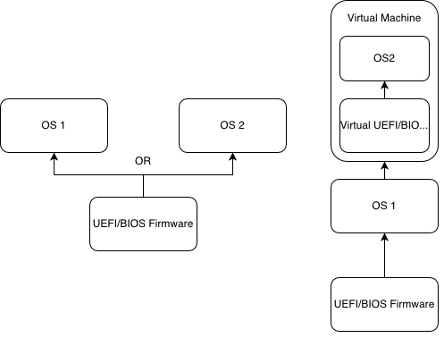

# What is multibooting?

Multibooting is the process of having multiple OSes booting off the same device and physically present on that device. You might say "well duh!" but some people do not know that you can only boot **one OS** at a time. Contrary to virtualisation, multibooting does *NOT* load all OSes at the same time but you turn off one to get to the other. Multibooting can be on any machine, whether it's a virtual one or a real one, as long as the firmware is able to boot either of the OSes, it's good.

Here is how we can see Multiboot vs Virtualisation:

Now that you made the difference, there are thing you need to know about dualbooting, mainly:

- Disk partitioning
- Bootloader location
  - Legacy
  - UEFI
- Bootloader selection
  - Legacy
  - UEFI
- Configuration of the bootloader

But before starting any of this

# PLEASE BACKUP YOUR DATA
