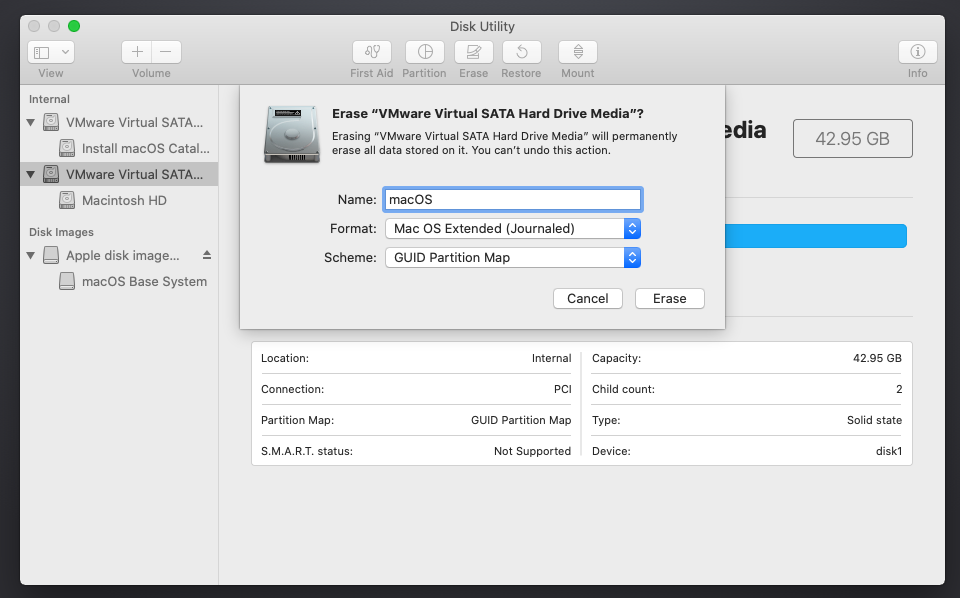

# Dualbooting on the same disk

Basically, you only have one empty disk and you want to install multiple OSes to it, it *does not matter if there are other disks*, as this section will only take care of one disk.

## Precautions

- BACKUP YOUR DATA
- If possible, disconnect or disable any other disk/drive in your system, as it may interfere with the install procedure (especially windows')
- The drive isn't corrupted or have bad sectors
- Stable power input

## Situation this applies for

- You already have macOS installed
- You have an empty disk with no OS installed

---

To start, it is recommended to install the OSes on an empty drive with this order (although it will be noted later that it doesn't matter):

1. macOS
2. Any other OS

and make sure to:

1. Format the disk with macOS disk utility
2. NOT to format the second partitions with MSDOS
3. Have an OpenCore USB disk with you

Here is how it goes:

### While installing macOS

1. Format your whole disk to GPT, this will ensure that macOS installer will create the necessary 200MB EFI partition that macOS requires (otherwise, APFS/HFS will not format the partition)
   
2. Once done, select "Partition", press "**+**" and choose the size of the other partition(s), "Format" MUST be `Mac OS Extended` or `APFS` (otherwise, macOS will convert the drive to hMBR which will break Windows installation).
   
3. Hit Apply and let it do its thing:
   - NOTE: on some macOS releases/setups, the disk utility may suddenly crash and send you back to the main menu, DO NOT PANIC (~~that sure helps~~), just wait for a minute or two then open disk utility back and check if the formatting is done.
4. Once done, you can install macOS on the partition of your choosing and continue along.

#### Note

- You can still do the above if you have macOS already installed, do NOT use bootcamp assistant.
  - BootCamp assistant will add extra drivers to the Windows installer that we do not need.

### For the others

#### Windows

Create your windows installer (on another computer with the windows creation disk utility or [Rufus](https://rufus.ie)). If you have issues, please see the [troubleshooting section](../troubleshooting.md)

#### Linux

Linux can be straightforward, unlike windows. Popular linux distros allow custom disk partitioning, just format the blank partition to EXT4 (or whatever other FS you prefer) and make sure you choose the EFI partition to point to where the bootloader will be installer (this should NOT "delete" OpenCore in any shape or form) and install. Other distros (like Arch) would do that manually anyway, just follow the standard procedure from the beginner guide (without formatting the EFI, because it's already formatted to FAT32) and follow through. Personally, I would recommend not to install other bootloaders (like systemd-boot or grub) for the likes of arch because OpenCore can boot linux kernels that have EFISTUB support, if you do however like using a separate bootloader, you can have it your way, it doesn't change anything.
