# On a filled non-OS related disk (Data disk)

This is quite easy, basically we'll just make some space for an EFI (if it doesn't exist already) and some for our macOS system.

## Precautions

- BACKUP YOUR DATA
- If possible, disconnect or disable any other disk/drive in your system, as it may interfere with our process. (keep only the target disk and/or the boot OS disk where we will do the operations from)
- The drive isn't corrupted or have bad sectors
- Your system is on pure UEFI setup, no CSM/Legacy OS installed
- Stable power input

## Situation this applies for

- A disk with data that is not related to windows or linux or macOS
- A disk that used to be for an OS but now it's just data

---

To start, we need to know what kind of partitioning scheme we're using, most new drives that are <1TB are usually MBR formatted (some 1TB drives still do) while anything bigger in size is GPT partitioned. As we saw before, macOS **requires** GPT and can't do without it.

Note: we do not speak of the MBR patch, that's a bad idea and really should not exist anymore since it doesn't make any sense when most 2006+ computers can easily boot a GPT drive without much issues.

## Checking your disk partitioning scheme

#### In Windows

- Open Disk Manager
- Right click on the destination drive > *Properties*
  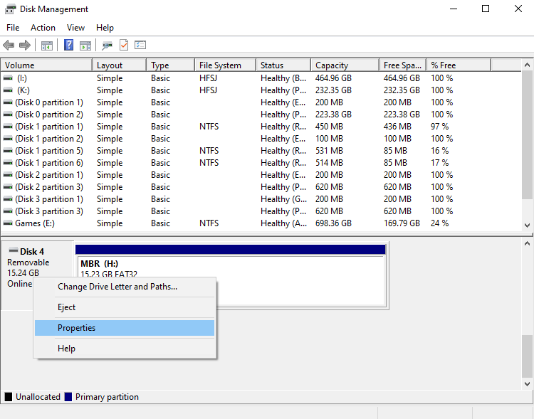
- Go to *Volumes* and check *Partition Style*
  - **MBR** drives will show:

    
  - **GPT** drives will show:

    

#### In Linux

- Download and install `gdisk` if it's not already installed

- Run `lsblk` to list your disks and partitions and check the identifiers (eg: `/dev/sda` or `/dev/nvme0n1`) of your destination disk with data

- Run `sudo gdisk -l <disk_identifier>` (eg: `sudo gdisk -l /dev/sda`)

  - **MBR** disks will output:

    ```
    Partition table scan:
      MBR: MBR only
      BSD: not present
      APM: not present
      GPT: not present
    ```

  - **GPT** disks will output:

    ```
    Partition table scan:
      MBR: protective
      BSD: not present
      APM: not present
      GPT: present
    ```

#### In macOS

- Run `diskutil list`

- Check the destination drive

  - **MBR** disks will have:

    ```
       #:                       TYPE NAME                    SIZE       IDENTIFIER
       0:     FDisk_partition_scheme                        *SIZE GB   diskX
    ```

  - **GPT** disks will have:

    ```
       #:                       TYPE NAME                    SIZE       IDENTIFIER
       0:      GUID_partition_scheme                        *SIZE GB   diskX
    ```

## Converting MBR to GPT

**Note**: if your drive is **already GPT**, then **skip this section**.

#### Destructive Conversion

This method will destroy all your data on your disk, making you a clean slate to work with. **Only use this if the data in the disk is not important or backed up already! YOUR DATA WILL BE GONE WITH THIS METHOD.**

You can use any partitioning tool of your choice and destroy the data, OR you can just boot macOS installer that you made with the OpenCore Dortania Guide and select the disk and format it. You can check [Dualbooting on the same disk](../empty/samedisk.md) section for more information. You're not required to follow the rest of this section.

#### Non-Destructive Conversion

This method has higher chances of keeping your data intact, **however this does NOT mean you can ignore backing up your data. BACKUP YOUR DATA!**

We will be using `gdisk` ran on any linux distribution, I strongly NOT recommend using Windows or macOS gdisk to perform this operation as it may break seeing how Windows and macOS disk handling differs from Linux. You can use a USB distribution like `gparted` (lightweight iso/usb image) to do the manipulations or any distribution disk in hand (arch, Ubuntu, Fedora...).

- Download/Install `gdisk` following you distribution

- Run `lsblk` to check for the destination drive identifiers

- Run `sudo gdisk <identifier>` (eg: `sudo gdisk /dev/sda`)

- If your disk is MBR, you'll be greeted with:

  ```
  Partition table scan:
    MBR: MBR only
    BSD: not present
    APM: not present
    GPT: not present
  
  
  ***************************************************************
  Found invalid GPT and valid MBR; converting MBR to GPT format.
  THIS OPERATION IS POTENTIALLY DESTRUCTIVE! Exit by typing 'q' if
  you don't want to convert your MBR partitions to GPT format!
  ***************************************************************
  
  
  Command (? for help): 
  ```

- Type `w` and press Enter/Return

- Press `y` to confirm

- You're done.

For those who want to other way around (from GPT to MBR) follow this [answer](https://superuser.com/questions/1250895/converting-between-gpt-and-mbr-hard-drive-without-losing-data).

#### Verification

Once your drive is converted, check again following the instruction above. You may want to reboot your computer before verifying.

## Partitioning the Disk

Once you converted (or already formated) your disk is GPT, it is time to repartition it for macOS partition and the EFI partition if there isn't.

### Checking the disk existing partitions

Just because the disk is now GPT partitioned, it doesn't mean that macOS will accept it, macOS's HFS Plus (Mac OS Journaled File System) or APFS won't accept formatting it and will return an error with `MediaKit reports not enough space on device for requested operation`, this is because either there is no EFI partition or it's not large enough. Either way, if you're just using a disk with non-OS data, chances are you do not have that partition and we will have to make one.

With that said, we still need to determine if it's required or not:

#### In Windows

- Open Disk Manager
- Check your destination disk
  - In case your disk already contains an EFI partition: (usually if your disk was already GPT or formatted before)
    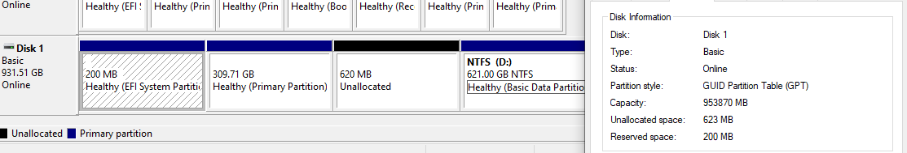
    - You'll see a description with `(EFI SYSTEM PARTITION)`
    - The size of this partition is usually between 100MB and 500MB (any more and it's a waste of storage space)
      - In case the size of it is <200MB, **expand** the partition to 200MB (or a bit more)
      - In case the size of it is >500MB, **shrink** the partition to 500MB (or 200MB) because it's a waste of space
      - In case you have multiple partitions with `EF00`, that means your partitioning is bad, you only really need just 1 EFI partition in the whole system (if not per disk, there is no real need for multiple EFI partitions, makes no sense)
  - In case your disk doesn't contain an EFI partition:
    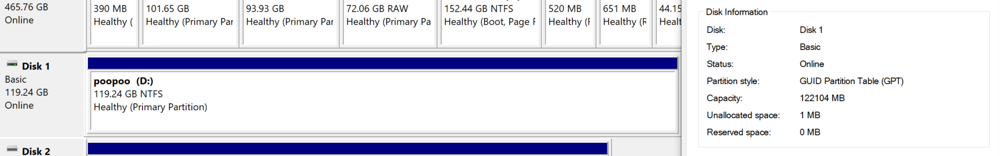

#### In Linux

- Download/Install `gdisk` following you distrubution

- Run `lsblk` to check for the destination drive identifiers

- Run `sudo gdisk <identifier>` (eg: `sudo gdisk /dev/sda`)

- When gdisk starts, send `p`

  - In case your disk already contains an EFI partition: (usually if your disk was already GPT or formatted before)

    ```
    Command (? for help): p
    Disk /dev/<identifier>: NUMBER sectors, SIZE GiB
    Model: SOME NAME     
    Sector size (logical/physical): 512/512 bytes
    Disk identifier (GUID): SOME GUID
    Partition table holds up to 128 entries
    Main partition table begins at sector 2 and ends at sector 33
    First usable sector is 34, last usable sector is 976773134
    Partitions will be aligned on 8-sector boundaries
    Total free space is 10261 sectors (5.0 MiB)
    
    Number  Start (sector)    End (sector)  Size       Code  Name
       1            2048          800767   390.0 MiB   EF00  EFI          // We're interested in this
       2          800808       213967975   101.6 GiB   AF0A  
       ... // Other partitions 
    ```

    - You'll find a partition with code `EF00` meaning it's marked as an EFI System Partition
      - The EFI partition does not need to be the first, it can be anywhere in the disk partitioning order, the `Code` of it is what matters the most
    - The size of this partition is usually between 100MB and 500MB (any more and it's a waste of storage space)
      - In case the size of it is <200MB, **expand** the partition to 200MB (or a bit more)
      - In case the size of it is >500MB, **shrink** the partition to 500MB (or 200MB) because it's a waste of space
      - In case you have multiple partitions with `EF00`, that means your partitioning is bad, you only really need just 1 EFI partition in the whole system (if not per disk, there is no real need for multiple EFI partitions, makes no sense)

  - In case your disk doesn't contain an EFI partition:

    ```
    Command (? for help): p
    Disk /dev/<identifier>: NUMBER sectors, SIZE GiB
    Model: SOME NAME     
    Sector size (logical/physical): 512/4096 bytes
    Disk identifier (GUID): SOME GUID
    Partition table holds up to 128 entries
    Main partition table begins at sector 2 and ends at sector 33
    First usable sector is 34, last usable sector is NUMBER
    Partitions will be aligned on 2048-sector boundaries
    Total free space is 2669 sectors (1.3 MiB)
    
    Number  Start (sector)    End (sector)  Size       Code  Name
       1            2048       250068991   119.2 GiB   0700  peepee       // a partition
       ... // Other partitions that are not EFIs 
    ```

    - There are no `EF00` partitions meaning we need to make one

#### In macOS

- Run `diskutil list`

  - Optionally you can add `diskX` with X as the identifier of the target disk if you don't want a big list of partitions and disks shown up, in most cases the disk numbers change from a system boot to another, so don't rely on it too much.

- Check your destination disk listing:

  - In case your disk contain an EFI partition:

    ```
    /dev/diskX (does not matter):
       #:                       TYPE NAME                    SIZE       IDENTIFIER
       0:      GUID_partition_scheme                         *SIZE*     diskX      // GPT disk
       1:                        EFI ESP                     209.7 MB   diskXs1    // Look for this
       2:                    FORMAT1 Part1                   *SIZE*     diskXs2    // a partition
         ... // Other stuff that aren't TYPE: EFI
    ```

    - We see a partition with `TYPE` as `EFI`, which means a disk with an EFI partition (and as you can see it's 200MB)
    - The size of this partition is usually between 100MB and 500MB (any more and it's a waste of storage space)
      - In case the size of it is <200MB, **expand** the partition to 200MB (or a bit more)
      - In case the size of it is >500MB, **shrink** the partition to 500MB (or 200MB) because it's a waste of space
      - In case you have multiple partitions with `EF00`, that means your partitioning is bad, you only really need just 1 EFI partition in the whole system (if not per disk, there is no real need for multiple EFI partitions, makes no sense)

  - In case your disk doesn't contain an EFI partition:

    ```
    /dev/diskX (does not matter):
       #:                       TYPE NAME                    SIZE       IDENTIFIER
       0:      GUID_partition_scheme                         *SIZE*     diskX      // GPT disk
       1:       Microsoft Basic Data poopoo                  128.0 GB   diskXs1    // a partition
         ... // Other stuff that aren't TYPE: EFI
    ```

    - There are no partitions with `TYPE` as `EFI`, although the disk is GPT, meaning we need to make one.

### In case you have an EFI partition

Congratulations, you can go ahead and partition your disk for macOS and be on your merry way, check the **Partitioning for macOS** section.

### In case you do not have an EFI partition

We'll have to make one, and the OSes that we will use will be either Windows or Linux (macOS is kind of a pain in the ass, not going to bother with it).

#### In Windows

We'll be using a disk managing software named `Minitool Partition Wizard`, ngl, it does look shady af and kind of like malware (and won't be surprised if it is). There are other alternatives like `Easeus Partition Master` (that suspiciously look like MPW 🤔) and `AOMEI Partition Assistant` (that also looks like the other two ***🤔 intensifies***), and many more but these are the most popular windows disk managers.

##### But where is muh GpArTeD?

The reason why I'm not recommending Gparted with NTFS partitions is that it might corrupt the partition easier than when Windows deals with it. I personally didn't have to deal much with corrupt NTFS partitions (I did once or twice) and Windows will surely fix them, but a lot of users reported unrecoverable partitions or data from using Gparted, not blaming Gparted, but using Windows with its own FS is safer than hoping ntfs-3g doesn't fuck up, that being said though, I'll post a Gparted guide below under `Linux` section, and if you already dealt with Gparted, I think you might know what to do.

In this section I'll be using MPW, the other tools are very similar and have very similar menus, you can follow up with them just fine. In this case, I will be using an external disk for the partitioning, it does not change anything about the internal disk, the same procedure goes for any disk.

- Download the ~~malware~~ partition manager of your choice (MPW here)

- Install the ~~malware~~ partition manager and **keep an eye on the adware and extra "apps" that they install, Chrome, Opera, some shady AV and so on**

- Run the application as Administrator

- Right Click on the target disk first partition and shrink it by 200MB (and bit more)
  
  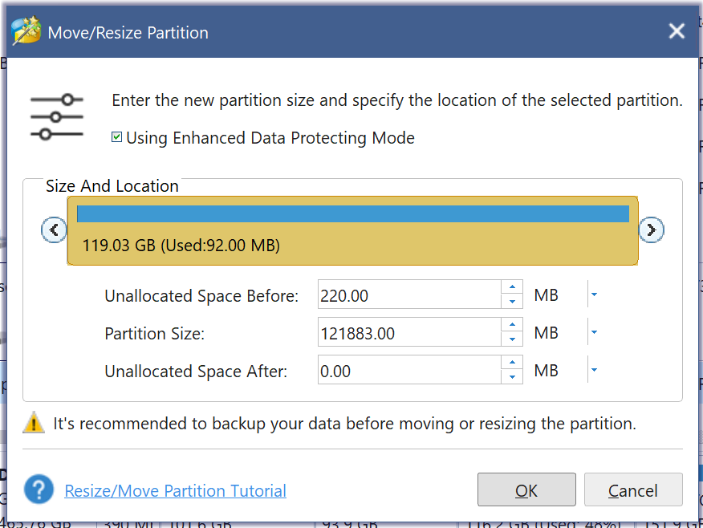

  - Note: because of the trashy software, here is how to do it properly:
    - change the size view from **GB** to **MB**
    - select the partition size and **press down arrow key** on your keyboard to lower its value
    - usually the Space After will be filled
    - once you hit your mark (say 220MB) select the Unallocated Space After section and **press down arrow key**
    - you'll see the Unallocated Space Before being filled
  - Note2: Moving the big slider will just create weird numbers and it's trash, so deal with it
  - Note3: I don't know if other partitioning software are this trash

- Once done, press apply on wherever the software shows you (in this version it's under the Operation Pending list, older releases had a dedicated button at the top of it, so check carefully the UI as it changes over time)

  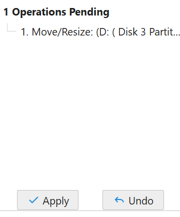

- **THIS PROCESS WILL TAKE TIME DEPENDING ON THE DATA ON YOUR DRIVE AND IF IT'S AN SSD OR A SPINNING RUST (HDD), DO NOT CANCEL IT UNDER ANY CIRCUMSTANCES OTHERWISE YOU'LL KILL YOUR DATA BYE BYE. YOU'VE BEEN WARNED!**

- You now have **empty space before the first partition**, this space will be used to create an EFI partition

  - Due to MPW managers being assholes, creating an EFI partition is now a paid feature
  - If you have an old version (9 or older) you can do that for free

- Once the operations are done:

  - Open CMD/PowerShell with Administrator rights

  - Run `diskpart`

  - Run the following commands:

    - `list disk`

      - Will show your disks, check the destination disk carefully
      - You can check Disk Manager as the disk numbering is the same

    - `sel disk X`

      - Where X is your destination disk number

    - `list part`

      - Will list partitions on that selected disk
      - Check the partitions as it may help you check for the destination
      - If it's not the desired disk, use `sel disk X` again and choose another one and check again

    - `create partition efi`

      - Will create a new partition of EFI type
      - This will make it hidden on the system and can only be explored with administrator privileges
      - It will take up the whole free space we made earlier

    - `list part`

      - You'll see a new partition with Type `System`
      - The size should roughly match the one we left earlier

    - `format fs=fat32 label="EFI"`

      - this will format that partition as FAT32 and give it the label "EFI"
      - Note: **in some cases** windows will return an error that `The device is not ready`, I'm not sure what could that be but we can fix it
      - Fix of Note:
        - Go back to MPW
        - Right click on the EFI partition (should be also detected as `EFI System Partition`) and select **Format**
        - 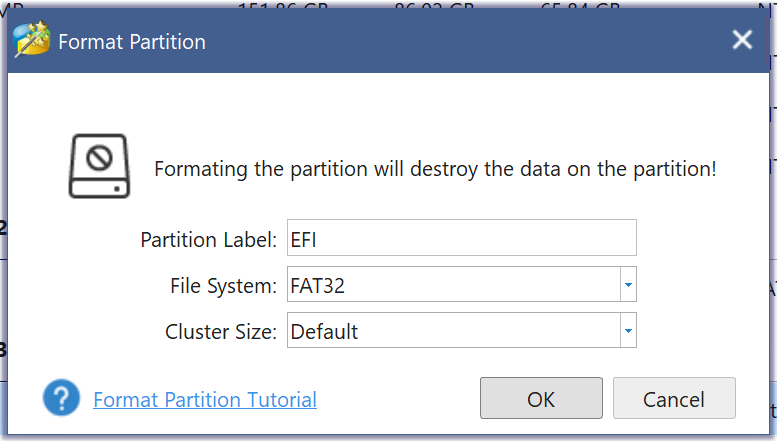
        - Press OK and be done with it.

    - Example of the output:

      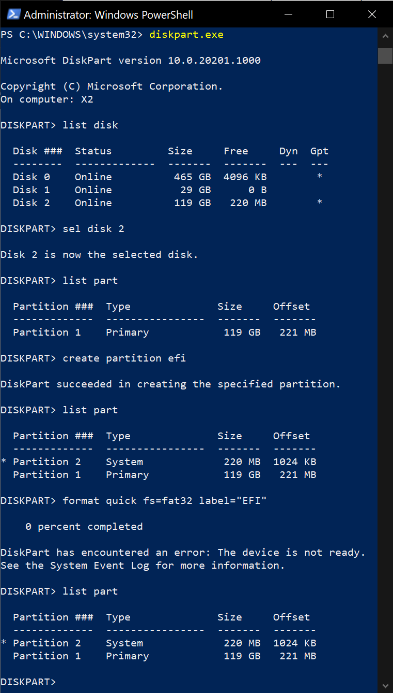

- Once done you can go to **Partitioning for macOS**

#### In Linux (my favourite)

We'll be using your favorite tool Gparted, if you're using parted/gpart, you're looking for a sad day. Let's get going.

- Install `gparted` following your distribution instructions (or use GParted ISO)

- Run `gparted`

- Select the destination disk from the list on the right

  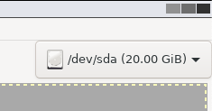

- Right click on the first partition then select **Resize/Move**

  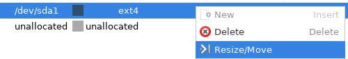

- Select the Free space preceding text zone and press **up arrow key** until you get to the desired size then hit Resize/Move

  

  - Note that if you went over the desired size then subtracted the extra amount, it **will be moved to the free space following** the partition, in this case just press `+` on the New size area until the space following zeros out, going for even more will decrease the free space preceding (logic, right? just don't mess up too much, thanks)

- You'll get this error, press OK, this matters if you have multiple partitions but usually most modern OSes (on UEFI) are quite resilient to this issue (by using UUIDs instead of partition numbering)

  

- Right click on the unallocated partition and select New
  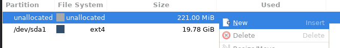

- In the *Create new Partition* box, set the following then press Add

  - Partition name (could be named EFI, it doesn't matter)
  - Label (could be named EFI, it doesn't matter)
  - File system: **FAT32**
  - 

- Press the green check mark on the toolbar to Apply Changes and confirm them
  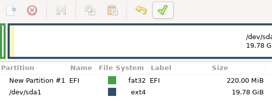
  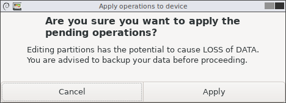

- **THIS PROCESS WILL TAKE TIME DEPENDING ON THE DATA ON YOUR DRIVE AND IF IT'S AN SSD OR A SPINNING RUST (HDD), DO NOT CANCEL IT UNDER ANY CIRCUMSTANCES OTHERWISE YOU'LL KILL YOUR DATA BYE BYE. YOU'VE BEEN WARNED!**
  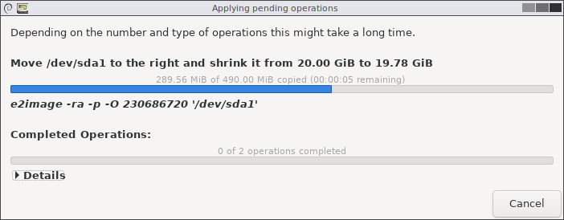

- Once done, right click on your newly created EFI partition and select "Manage Flags"
  

- Select `esp`, gparted will select `boot` automatically, keep it that way

  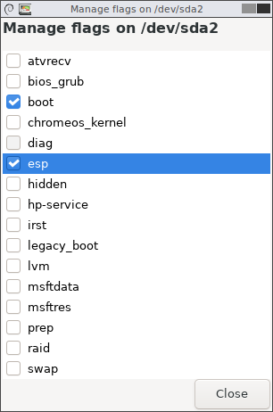

- It will be done instantly, check your flags
  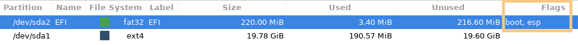

  - You can also check in `gdisk` for `EF00`

- Once done you can go to **Partitioning for macOS**
