# Windows

You have one disk with Windows installed and want to install macOS on the same disk.

## Precautions

- BACKUP YOUR DATA
- If possible, disconnect or disable any other disk/drive in your system, as it may interfere with the install procedure
- The drive isn't corrupted or have bad sectors
- Stable power input

## Situation this applies for

- You have a disk with Windows installed
- You have enough free space on the disk to support a macOS installation

---

Verify the partition style of the disk is GPT. If you do not know, see: [Checking your disk partition scheme](https://dortania.github.io/OpenCore-Multiboot/exist/data.html#checking-your-disk-partitioning-scheme) and if it is MBR, see: [Converting MBR to GPT](https://dortania.github.io/OpenCore-Multiboot/exist/data.html#converting-mbr-to-gpt).

## Resize existing EFI partition

If your EFI partition is bigger than the default of 100MB (at least 200MB to be safe) which is created by the Windows installation, then you can skip to the next section.

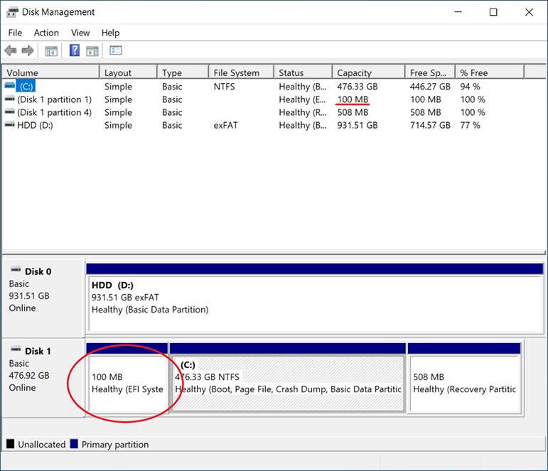

Use a bootable partition manager to resize the EFI partition. To do this you must first move all the partitions in front of it so make sure to backup your data. 

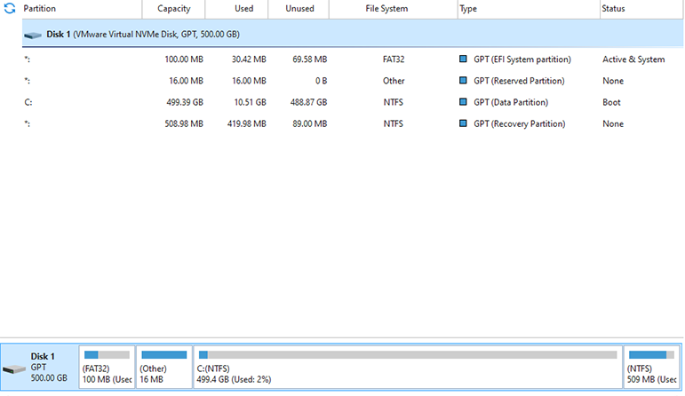

Moving a partition cannot be done while running Windows, so you will need a **bootable** partition manager. This is a potentially destructive operation. Backup your data and proceed at your own risk. If there is not enough free space to move existing partitions to the right, first shrink the existing Windows one. 

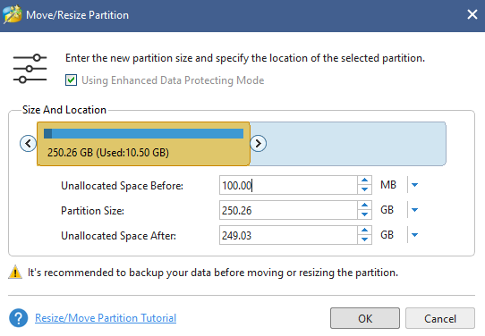

Once there is enough free space after the EFI partition, extend it to at least 200MB. 

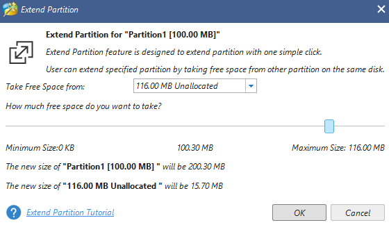

## Resize Windows partition 

If you already have free unallocated space to create the macOS partition, you can skip to the next section. 

Use a partition manager shrink to your Windows partition so that there is enough free space to create a partition that will hold your macOS installation. 

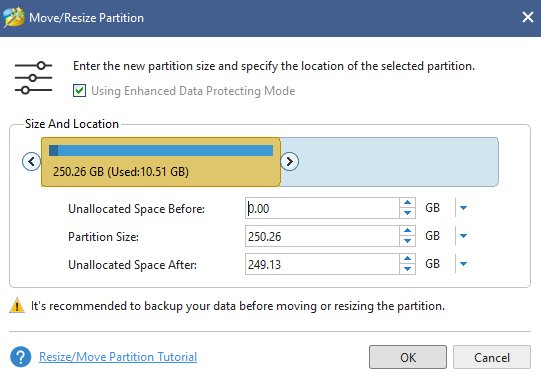

## Create new partition for macOS

Create a new exFAT **or FAT32** volume on the free unallocated space. 

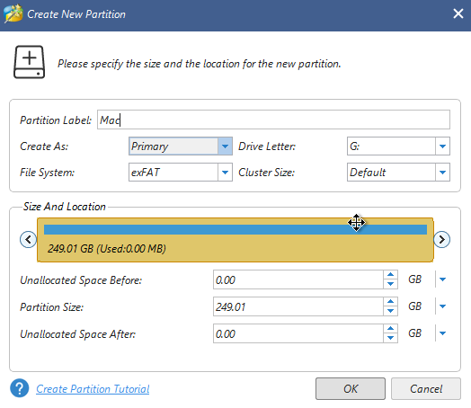

If you have other drives you intend to use between both operating systems, now is a good time to format them too. Don't forget to unplug the other drives before proceeding with the macOS installation. 

If you moved partitions around, verify your Windows installation is still functioning before proceeding. If you cannot boot into Windows, restore your backup and try again using a reputable partition manager.

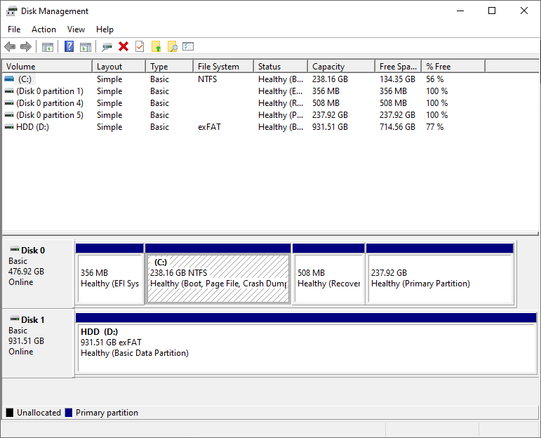

For the next section, you will need your OpenCore USB ready to boot into the macOS installation. 

## Reformat partition to APFS using Disk Utility

It is advised to use [LauncherOption=Full](https://dortania.github.io/OpenCore-Post-Install/multiboot/bootstrap.html) or to create a custom BIOS entry for the USB so that during the installation process when the system reboots, it will not automatically boot into Windows. When system reboot does happen during the installation process, even if OpenCore loads, the picker's default option might be Windows so watch it carefully and be ready to press the arrow keys depending on how short the timeout is set in your config.plist: `Misc > Boot > Timeout`.

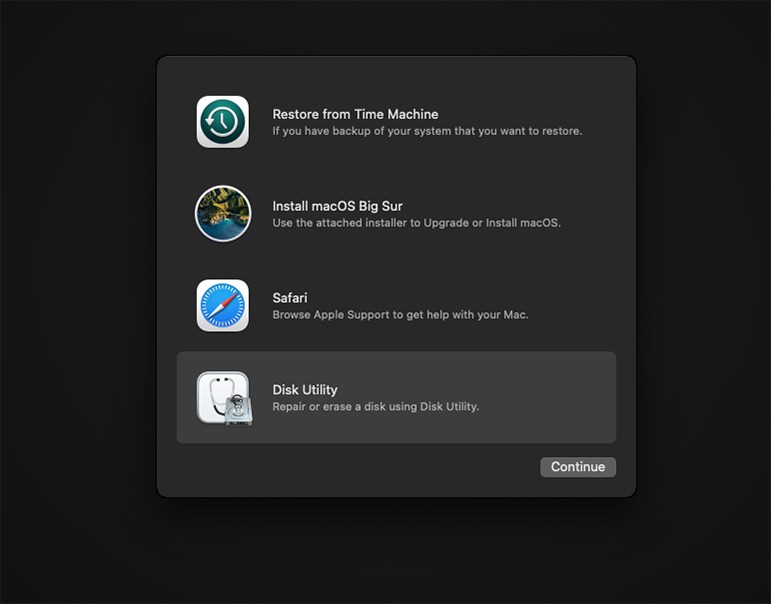

Once you reach the main installation menu click Disk Utility and select the target partition. Click Erase in the top button bar to format the partition to APFS (or whatever you prefer).


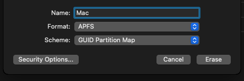

## Continue with macOS installation

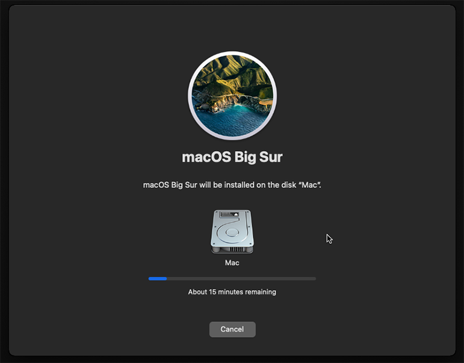

Once installation is finished remove OpenCore USB and the system will boot into Windows.

## Mount EFI partition from Windows

Using diskpart or partition manager, mount the EFI partition. To do this with diskpart, launch command prompt with administrator privileges and enter:
```
diskpart
list disk
select disk 0
list partition
select partition 1
assign letter=e
exit
``` 
Once the partition is mounted you will be able to see it but no access it. To be able to read/write to EFI, restart File Explorer with administrative privileges. 
```
taskkill /im explorer.exe /f
explorer.exe
```
You can also use [Explorer++](https://explorerplusplus.com/download). Right click and select Run as administrator to read and write to the EFI folder.

After read/write access is obtained, plug your OpenCore USB and backup your existing EFI folder before continuing. 

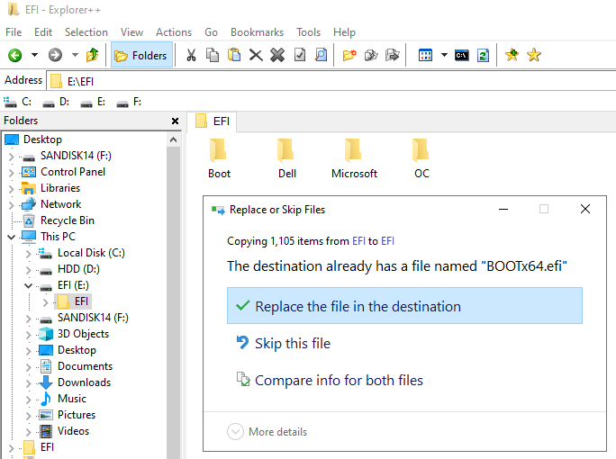

 Copy the BOOT and OC folder from inside the USB EFI into the partition's EFI folder from within Explorer++. When prompted, overwrite the BOOTx64.efi that exists with the one from OpenCore.

## Manually add OpenCore boot menu option

Open command prompt with administrator privileges and run:

```
bcdedit /set {bootmgr} path \EFI\OC\OpenCore.efi 
```

After this is complete, do a reboot of the system.  If the OpenCore picker shows, then you can skip the next section.

Using your BIOS setup menu, add a custom boot entry for OpenCore to `EFI/OC/OpenCore.efi`. If you are unable to add custom entries to the BIOS boot menu there are tools available to accomplish this:

* [UEFI shell](https://wiki.archlinux.org/title/Unified_Extensible_Firmware_Interface#Obtaining_UEFI_Shell)
* [efibootmgr](https://github.com/rhboot/efibootmgr)
* [BOOTICE](https://m.majorgeeks.com/files/details/bootice_64_bit.html)

## Change startup disk

When OpenCore loads, your default boot entry may be Windows, so be ready with the arrow keys. Once you are into macOS, you can change the default picker option using Startup Disk in System Preferences.

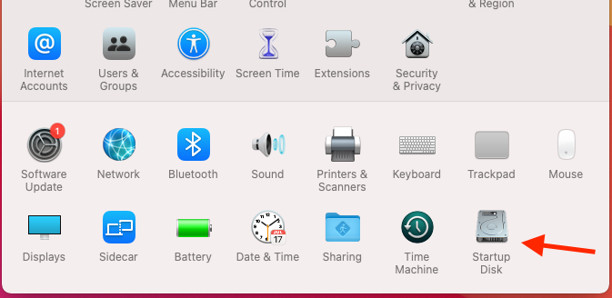

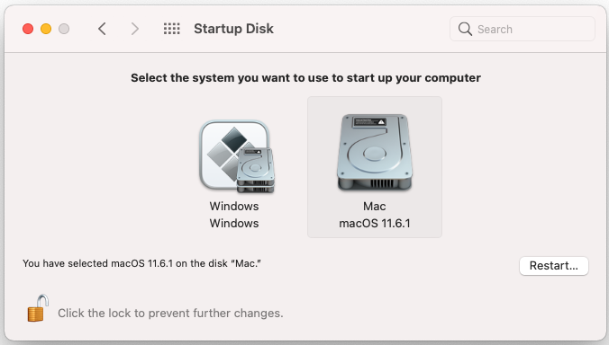

If your default option is Windows, then you can change it to macOS or vice versa. 

When restoring a full disk backup of a dual boot Windows/Mac, the system may boot into Windows; if so, run bcdedit command above to restore OpenCore picker again. As a final note, don't forget to delete OpenCore USB boot entry in BIOS.