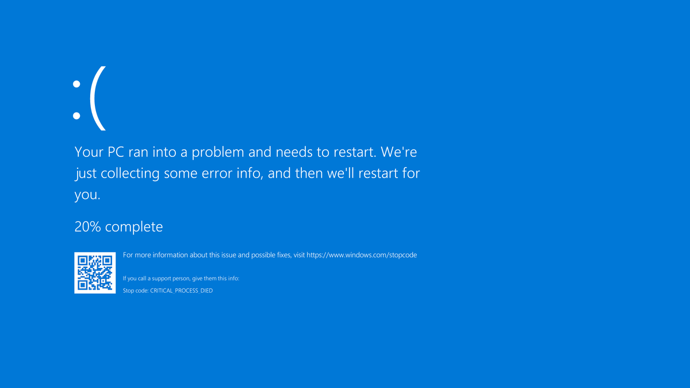
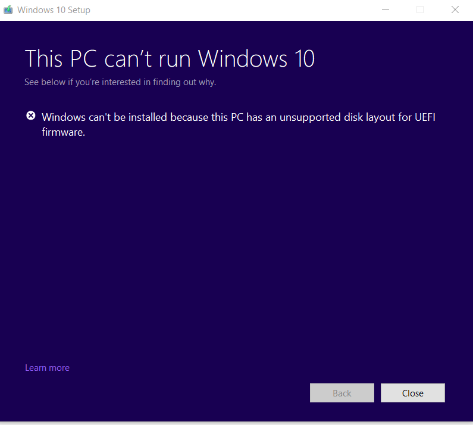
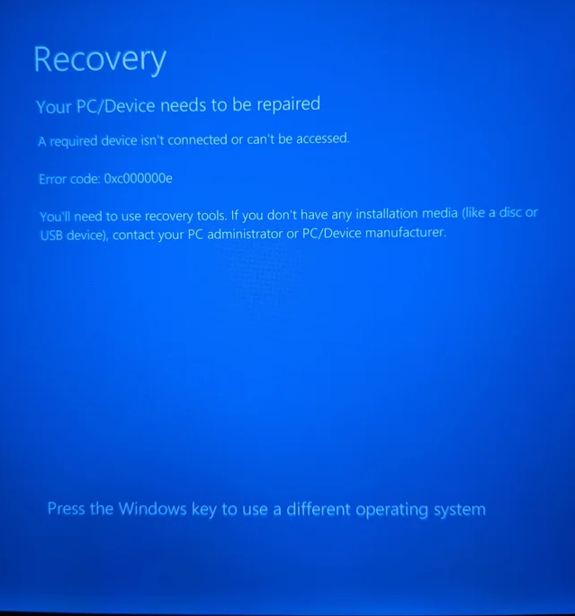

# Troubleshooting

Multiboot troubleshooting. **Work in Progess**, you can help contibute via [PRs](https://github.com/dortania/OpenCore-Multiboot/pulls)

## Windows



Windows can be a bitch when it comes to multidisk setups (it freaks out when it sees a lot of EFI partitions on a lot of disks).

If it happens, disable/disconnect all the other disks and install windows as you would normally do, selecting the correct disk. If it doesn't work you [can install windows manually](./Win.md#Manually).

### Unsupported Disk Layout for UEFI Firmware



You should [add a msr partition](https://www.tomshardware.com/news/how-to-fix-windows-10-unsupported-disk-layout-uefi-error,35960.html)

### WinRE doesn't work


WinRE doesn't work when appears this image.

I suppose you have created the recovery partition. If you don't, you can still create it.

Copy install.esd/install.wim from your usb in your pc.

Use [7zip](https://www.7-zip.org) or WinRar to open the WIM/ESD image. Open any of the numbered folder (it's the same).

Then go to `\Windows\System32\Recovery`. Extract the two files and copy them to path `C:\Windows\System32\Recovery`.

Then apply the two command below to active WinRE.

`reagentc /setreimage /path C:\windows\system32\recovery`

`reagentc /enable`

To see the WinRE status then type `reagentc /info`

To try WinRE, type `reagentc /boottore`

Reboot

### Opencore does not see my Windows 8/10 installation

MBR based Windows installs **ARE NOT SUPPORTED** by OpenCore at this time, you will need to convert it to GPT.

Otherwise, if you have been on GPT yet, I think you are using an old version of OpenCore.

#### Solution 1: [Update Opencore](https://dortania.github.io/OpenCore-Post-Install/universal/update.html)

#### Solution 2: BlessOverride solution (add the following lines to your config.plist)

```
Misc -> BlessOverride -> \EFI\Microsoft\Boot\bootmgfw.efi
```

* **Note**: As of OpenCore 0.5.9, this no longer needs to be specified. OpenCore should pick up on this entry automatically


#### Solution 3: Boot to recovery mode from within Windows

::: This is long, so i create a spoiler

* **make sure you boot windows from OpenCore**
  * after loading OpenCore, press space > OpenShell (make sure you have it in Tools and in the config)
  * run `map -r -b`
  * look for your EFI drive (usually it's in the first lines, watch out if you're a multidisk user, there might be many EFIs)
  * run `FSX:\EFI\Microsoft\Boot\bootmgfw.efi` where X is the number of the EFI partition with windows bootloader
* **make sure that RequestBootVarRouting is set to True**
* open CMD/PS with admin rights
* run `shutdown /r /o /t 0`
  * this will reboot your windows system immediately to Advanced Boot Menu menu
* select Troubleshoot > Command Prompt
* it will reboot to WinRE and you'll get to the Command Prompt
* once in there
  * run `diskpart`
  * once loaded, send `list vol`
  * look for your Windows drive letter
    * it may not have the `C` lettering, but make sure you check the size and other indicatives that points to it
    * if you cannot, just write down the mounted letters with (NTFS) filesystem then explore them one by one to check if it's your windows install
  * look for your EFI partition
    * it should say `hidden` or `system` and is usually 100-200MB (some OEM installs make it bigger as much as 500MB)
      * send `sel vol X` where X is the EFI partition number
    * if you're in doubt
      * send `list disk`
      * identify your windows disk
      * send `sel disk X` where X is the disk where Windows is installed on
      * send `list part`
      * check the partitions, usually the EFI should have 100-200MB (some OEM installs make it bigger as much as 500MB)
      * send `sel part X` where X is the EFI partition number
    * either way, send `assign letter=S`
      * S can be anything other than A/B/Y/X and any letter already assigned in the listing before it
  * send `exit` to close diskpart and return to the command prompt
  * run `bcdboot X:\Windows /s S: /f UEFI`
    * [bcdboot](https://docs.microsoft.com/en-us/windows-hardware/manufacture/desktop/bcdboot-command-line-options-techref-di) is a utility that installs Windows bootloader in either your EFI or root system partition (of choice)
    * `X:\Windows` is a path to the Windows installation folder, where X is the mount letter of the Windows partition
    * `/s S:` is the destination disk that will receive the bootloader, in our case, it's the EFI partition
    * `/f UEFI` to specify the type the bootloader should be (UEFI Bootloader)
    * This will copy a new bootmgfw.efi file as well as add a new NVRAM Boot entry which hopefully will now appear on OpenCore boot menu.
* if everything ran without any errors, type `exit` and it should return you back to the Advanced Boot Menu (or reboot)
* reboot and check if Windows boot entry has been added
:::
